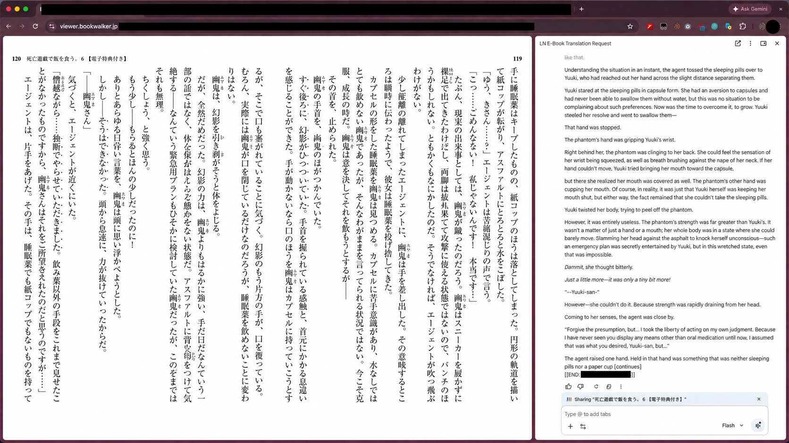
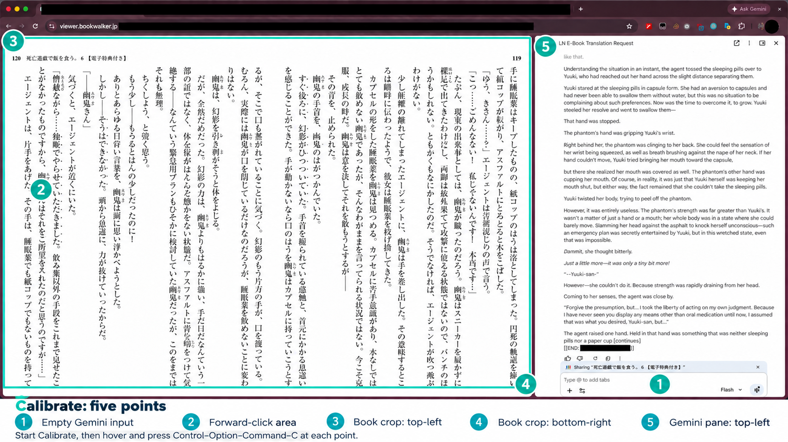

# Babelbound

*Across languages. Between covers.*

**A macOS book translator for BOOKWALKER with Gemini or ChatGPT in Chrome, with resumable jobs and illustrated HTML and EPUB exports.**

Choose a model and a batch size. Babelbound translates the current screen, saves the response, and turns the page. If a step fails, it pauses with the saved state available for review and recovery. In the menu bar, look for **BT**, short for **Book Translator**.

**Independent, unofficial project.** Babelbound is not affiliated with, endorsed by, or sponsored by Google or OpenAI. Gemini and Chrome are Google products; ChatGPT is an OpenAI product. See the [third-party notices](NOTICE.md).

**Version 1.5.0 · Lua / Hammerspoon · Python / Pillow · Chrome / macOS**

[Try the reading copy](#try-the-reading-copy) · [Setup](#install) · [Calibration](#first-translation) · [Model choice](#your-gemini-plan-and-model) · [Reading copies](#saved-output) · [Documentation](#documentation)

## Where it works

**Babelbound is built for BOOKWALKER’s paginated reader in Chrome on macOS, with the book on the left and Gemini’s sidebar on the right in the same window.** The bundled prompt translates Japanese light novels into English. That is the original working setup. **Experimental ChatGPT support** uses the official ChatGPT Chrome extension’s side panel in the same layout; see [ChatGPT setup and limits](docs/chatgpt.md).



*BOOKWALKER on the left, Gemini on the right. This documentation image comes from a working session and has been cropped and redacted.*

Compatibility depends on how the book is displayed and how its pages turn. Calibrate records five screen positions; it does not teach Babelbound how to use an arbitrary reader.

| Requirement | What that means in practice |
| --- | --- |
| A complete, readable page or spread | All the content for one translation fits inside a single rectangular crop, entirely left of the chat panel and on one display. Single-page and two-page layouts are both usable; one saved “screen” is the whole visible page or spread. |
| A consistent forward-click target | One mouse click at the same position advances to the next page or spread. Verify the direction yourself, especially in a right-to-left reader. Babelbound does not scroll the source, swipe, drag, or use keyboard paging. |
| A stable reader layout | Keep the window, zoom, sidebar width, and page layout fixed during a batch. The next page must visibly change and then settle. Moving or resizing the window, changing tabs, or obscuring the page interrupts this workflow. |
| The provider can read the current book tab | Confirm this manually first. The saved screenshot crop is used for verification and artwork; Babelbound does **not** upload it as an image attachment. |
| Browser controls Babelbound can verify | Hammerspoon needs Accessibility and Screen Recording access. Chrome must expose the reader and the selected provider’s input, Send, and Copy controls in the form Babelbound expects. The default control labels are English. |

During calibration, you identify the provider’s empty input, the book’s forward-click target, the two corners of the book rectangle, and the top-left of the chat pane. See the [calibration walkthrough](docs/usage.md#calibrate-the-visible-reader) for the exact sequence. Use **Preview source crop**, then complete a short three-screen batch before committing to a long run. A successful calibration alone does not prove that page turning or source access works.

**Outside the current integration:** continuous-scroll books, readers that require swipes or moving click targets, separate reader/chat windows, and native apps such as Apple Books or Preview. There is no direct PDF, EPUB, CBZ, or image-file import; EPUB is an output format. Other websites and Chrome’s PDF viewer are unvalidated and may require code and prompt changes even if their layouts look similar to BOOKWALKER.

## Your plan and model

Babelbound uses **your own Google account and Gemini access in Chrome**. Requests use your account’s model access and usage allowance; Babelbound does not provide a separate plan or require an API key. Availability and limits can change, so check [Google’s current plan and model information](https://support.google.com/gemini/answer/16275805?hl=en) rather than assuming a fixed number of pages per day.

The ChatGPT provider uses **your own ChatGPT account, selected model, and available allowance** through the official extension. It does not use an API key or change your model for you. Select **BT → Provider → ChatGPT extension**, then calibrate that panel separately. [Setup details](docs/chatgpt.md).

Choose the model yourself: click the model name inside Gemini’s input box, select the model you want, and close the picker before starting Babelbound. Pause Babelbound before changing models mid-job. The tool uses that selection and records the observed model for each saved screen. [Google’s Chrome guide](https://support.google.com/gemini/answer/16283624?hl=en) documents the model picker and account requirements.

**If you don’t have Google AI Ultra, I recommend Flash for this workflow.** It is my practical default for translating a book. Ultra is not a Babelbound requirement, and you can select Pro or another model when your account offers it.

**Flash-Lite gave significantly worse translations in the comparison behind that recommendation.** The same 20 reader screens were translated with the same prompt in separate conversations. On the 15 prose screens, the source-based review scored Flash-Lite **5.0/10**, versus **9.1/10** for Flash. Flash-Lite’s problems included missing passages and reversed meanings; Flash still made errors and needed review.

Those are this project’s blind AI-reviewer assessments of one sample, not a universal model benchmark or a promise about future versions. The observed UI selections were 3.5 Flash-Lite and 3.8 Flash; the backend models were not independently verified. Babelbound can run with Flash-Lite, but I would not use it for a faithful reading copy based on those results.

## What it does

- Translates batches of visible screens or spreads, saving each accepted response before turning the page.
- Resumes saved jobs with checks for the correct source page and any pending response.
- Shows the loaded book title in **Start / resume** and progress such as **BT translating (42%)**.
- Distinguishes deliberate pauses, warnings, active work, and finished batches.
- Stores jobs in named folders such as `Book-The Lantern Archive - Vol. 01`.
- Records the provider and observed model selection for each translation.
- Extracts illustrations from saved captures and inserts them in reading order.
- Exports a self-contained EPUB for Apple Books, including artwork and any reviewed English cover layouts.

## Try the reading copy

You can try the export without setting up Chrome, Hammerspoon, or a model-provider account. With Python 3.10+ and the [Pillow dependency](requirements.txt) installed, run:

```sh
python3 scripts/demo.py --output demo-output
```

Open `demo-output/translation.html`, or import `demo-output/translation.epub` into Books. The demo uses invented English text and generated artwork to show the reading format; it does not translate a source book. Use a new output directory each time—the command leaves existing files alone.

## Install

You need macOS, Google Chrome with a working Gemini sidebar or the official ChatGPT extension, [Hammerspoon](https://www.hammerspoon.org/), and [Python 3.10 or newer](https://www.python.org/downloads/macos/). The illustration and EPUB helpers use Pillow.

Download or clone this repository, then run from its directory:

```sh
./scripts/install.sh
```

The installer creates a helper environment, copies the modules, backs up files it replaces, and adds the load line to your Hammerspoon configuration if absent:

```lua
GeminiBook = require("gemini_book")
```

Use Hammerspoon’s **Reload Config** after installation. Grant Hammerspoon Accessibility and Screen Recording access when prompted. See [installation and configuration](docs/installation.md) for the full setup, updates, and custom paths. Hammerspoon’s [Getting Started guide](https://www.hammerspoon.org/go/) explains its configuration and reload controls.

Existing Gemini Book Translator installations can [upgrade without migrating jobs or configuration](docs/installation.md#upgrading-from-gemini-book-translator).

## First translation

1. Open a book you have permission to translate in BOOKWALKER’s Chrome reader.
2. Select the provider in **BT → Provider** and open its sidebar in the same Chrome window. For Gemini, share the book tab. For ChatGPT, follow the [extension setup](docs/chatgpt.md). Select the model you want and leave the input empty.
3. Keep the book on the left and the selected chat panel on the right, with the window on one display.
4. Choose **BT → Calibrate**, then follow the five hover prompts using **Control–Option–Command–C**. No clicking is needed to record the points.
5. Choose **Preview source crop**. Check that it contains the whole visible book page or spread, without browser controls or the chat pane.
6. Choose **New job on current screen** and start with three screens. The current visible screen is the first one. A screen may contain more than one printed page.
7. Let the automation use that Chrome window. **Control–Option–Command–P** pauses it; **Control–Option–Command–X** stops it while retaining saved work.



*The numbers and teal outline are a guide overlay. Record the corresponding positions in your own window; the forward-click area depends on the reader’s layout and reading direction.*

The normal request mode sends the bundled translation prompt directly. Creating a Gemini `/ln` skill is optional.

When the requested batch completes, Babelbound leaves the last translated screen visible and builds the reading copy. **BT → Open EPUB in Books** opens the saved ebook on the Mac. Transfer `translation.epub` to your iPad and open it in Books; the illustrations travel inside the file.

## Continue a book

Use **Start / resume — [book title]** to continue the loaded job. After a reload, use **Restore latest saved job** or **Choose saved job…**, review the book’s position, then resume. Restoring does not start translation.

If the previous batch is finished, Start / resume asks how many additional screens to translate. **Finished means the requested batch is complete, not that Babelbound has independently detected the end of the book.**

Read [usage and recovery](docs/usage.md) before retrying a pending request or an uncertain page turn.

## Saved output

The default output root is `~/Documents/GeminiBookTranslations`. Each job contains its checkpoint, source captures, individual translations, model metadata, and reading copies:

```text
GeminiBookTranslations/
└── Book-The Lantern Archive - Vol. 01/
    ├── checkpoint.json
    ├── page-metadata.json
    ├── translation.md
    ├── translation.html
    ├── translation.epub
    ├── sources/
    ├── pages/
    ├── responses/
    └── illustrations/
```


*An actual EPUB layout check in Apple Books on macOS. Artwork and translated text travel together inside the EPUB; this is an output example, not a supported source reader.*

Use **Rename current job…** to change a title while the job is paused and background saves have finished. Babelbound updates the job’s paths without changing its request IDs or translated text.

## Documentation

- [Installation and configuration](docs/installation.md)
- [Usage, shortcuts, statuses, and recovery](docs/usage.md)
- [ChatGPT extension setup and testing limits](docs/chatgpt.md)
- [Illustrations, HTML, EPUB, and model metadata](docs/reading-copies.md)
- [Troubleshooting](docs/troubleshooting.md)
- [Design notes](docs/design-notes.md)
- [Architecture](docs/architecture.md)
- [Contributing](CONTRIBUTING.md)

## Testing and limits

The repository includes synthetic Python and Lua regression suites for response parsing, duplicate-submit prevention, source review, renames, status, illustration assets, and EPUB output. [Run them locally](tests/README.md); CI runs the portable suites. Native Chrome interaction and Apple Books pagination also need manual macOS testing. A passing parser test can't tell you that Google moved a button.

The current integration targets macOS, the standard Chrome application, BOOKWALKER’s visible reader, and the selected chat sidebar. ChatGPT support is experimental; Gemini is the established integration. English UI labels are the default. It is not a headless browser crawler and cannot translate unseen pages without turning to them. It does not automatically change models or assess their translation quality.

Babelbound stores screenshots, translations, and diagnostic traces locally. The selected provider processes the visible page through your existing Chrome session. Documentation includes intentionally selected, redacted screenshots of the working setup. Full book archives, saved jobs, credentials, and personal browser state are not included in the repository.

## License

The code and original project documentation are available under the [MIT License](LICENSE), including for commercial use, modification, and redistribution subject to its notice requirements.

The documentation screenshots contain third-party book content, artwork, and interface elements. Those materials are excluded from the MIT grant; see [NOTICE](NOTICE.md). The license covers this project's contributions, not rights to the books you translate.
