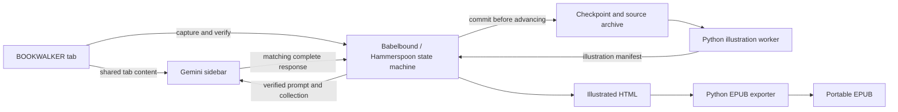

# Design notes

I started with a fairly ordinary complaint: translating a book required too much back-and-forth. Getting a translation was only one step. I still had to keep track of the page, save the result, move forward, and recover when the browser stopped cooperating.

The project grew through that workflow. I used Codex to implement and test changes, then fed the failures and rough edges back into the next iteration. Some features were obvious, like showing the book title next to Start / resume. Others only became obvious after using the output—an EPUB that technically opened could still be unpleasant to read.

The name Babelbound combines Babel’s languages with a bound book: the point is to end up with something you can read.

## A saved response has to belong to the right page

A response being visible is not enough. It might be incomplete, left over from the previous page, or associated with a request that was retried.

Each request gets an ID, a source screenshot fingerprint, and a persisted pending record. The response includes matching BEGIN/END markers and brief source anchors. A complete, matching response can become a committed screen; a timeout cannot.

That distinction also changes recovery. If Gemini already received a request, a collection failure should lead to another attempt to collect that reply. Sending the prompt again is a separate, explicit action. Otherwise a clipboard problem turns into duplicate translations and a much harder state problem.

These checks establish bookkeeping and completion, not translation accuracy. A model can produce a properly formatted answer that still needs editorial review.

## One click needs evidence

A page-turn click can be dropped. It can also land on the wrong surface if focus or geometry changed. Blindly clicking again makes it hard to know whether the reader is one page ahead or two.

Babelbound records its turn state before delivering one forward click. Then it verifies a changed, stable source image. If the result is ambiguous, it keeps the uncertainty and pauses. Recovery starts with the saved evidence instead of assuming the click worked.

The same principle applies after a layout change. A different screenshot hash does not prove that the book advanced. The source-review path lets a person confirm that the content is the same while retaining the original capture.

## Faster should mean less unnecessary waiting

There were too many places where the initial workflow just waited. Readiness polling now targets three starts per second, with quicker focus and draft-readback checks where the state is observable.

Some waits still have a reason. A book page must remain stable for two seconds before it is trusted, accessibility traversals are bounded, and Gemini's generation time is outside the local machine's control. The useful optimization is to continue when the required state is actually ready—not to pretend that every operation will be ready after an arbitrarily short delay.

There is no claimed pages-per-minute benchmark here. Browser versions, conversation length, network latency, source density, and the selected model all affect the result.

## Status is part of correctness

“Paused” used to cover too many different outcomes. It could mean a deliberate pause, an error, or a successfully completed batch. Those states imply different next actions.

The menu now shows warnings and completion separately. Active states show a percentage, and the primary action names the loaded book: Pause, Resume, Review problem, or Translate more after a completed batch. Reading copies, books, setup, and advanced tools each have a group. Progress counts committed screens against the current requested target. It does not count a pending response as saved, and it does not claim to know the entire book's length.

This also explains why model metadata is kept even when it is uncertain. The observed selection is useful information; guessing an unobserved backend model would make it less useful.

## A reading copy should actually be portable

The HTML reading copy uses neighboring image files. That is convenient on the Mac but fragile when someone transfers only the HTML file to another device.

EPUB packages those resources together. It keeps searchable/reflowable text, includes the illustrations, and carries model provenance without repeating automation labels throughout the novel. Reviewed cover and character-page layouts become composed images with a readable transcript below them.

The first EPUB structure gave every capture its own reading document. Apple Books could interpret those boundaries as chapter starts and leave unnecessary space in a spread. The current exporter uses one continuous document, with a table of contents pointing to screen anchors. It also removes generated capture headings and `[continues]` markers from the ebook only.

That last point matters: export cleanup does not rewrite the underlying translation. It does not guess how fragments should join or delete repeated prose. The original HTML, checkpoint, source screenshots, and responses remain available for review.

## Model choice needed a comparison

Model selection initially looked like a configuration detail. It turned out to have a direct effect on whether the saved result was worth reading.

A comparison in this workflow translated the same 20 source captures with Flash-Lite and Flash, using the same prompt and separate fresh conversations. Each capture could contain one or two printed pages. Five were front matter or illustrations; fifteen contained prose.

The outputs received randomized blind A/B labels for each screen. AI reviewers checked them against the Japanese source, and every candidate received an independent second check. The rubric weighted accuracy at 50%, completeness at 25%, names/numbers at 15%, and fluency at 10%.

| Observed selection | Mean score on 15 prose screens | Screens with major errors across the 20-screen sample |
| --- | --- | --- |
| 3.5 Flash-Lite | 5.0/10 | 15 |
| 3.8 Flash | 9.1/10 | 3 |

That is why I recommend Flash for this workflow when Ultra is not available, and why I would not choose Flash-Lite for a faithful reading copy based on this sample. Missing passages and reversed meanings matter more than a response sounding fluent. Flash also made errors, so the recommendation still includes review.

These scores are blind AI-reviewer judgments from one sample, not an independently validated general benchmark. The model names came from Chrome's interface; the backend serving models were not independently verified. The passes ran at different times, so their timings do not establish a controlled speed advantage. This comparison did not evaluate Pro or prove that any subscription plan guarantees a particular translation quality.

The full comparison corpus and book translations are not included in the repository. Broader claims would need more source material, independent Japanese-language review, and repeated runs across model versions. The existing study is useful evidence for the project's recommendation, with those limits.

## Engineering decisions you can inspect

The interesting failure is often one step after the apparent success: Gemini answered, but Copy failed; a click was delivered, but the book stayed put. These are the cases the persistence and verification code has to handle.

| Decision | Implementation | Regression evidence |
| --- | --- | --- |
| Keep an already-sent request recoverable without sending it twice | [Pending-request state machine](../hammerspoon/gemini_book.lua) | [Prepared-draft and resume tests](../tests/test_prepared_resume.lua) |
| Record page-turn state before one click, then verify the result | [Book focus checks](../hammerspoon/gemini_book_focus.lua) | [Turn delivery and interruption tests](../tests/test_turn_focus.lua) |
| Preserve request IDs and saved work when a book folder is renamed | [Journaled rename transaction](../hammerspoon/gemini_book_rename.lua) | [Collision and rollback tests](../tests/test_rename.lua) |
| Give errors, pauses, and completion distinct meanings | [Status and progress policy](../hammerspoon/gemini_book_status.lua) | [Status tests](../tests/test_status.lua) |
| Wait for illustrated HTML before publishing an ebook | [Asynchronous export queue](../hammerspoon/gemini_book_epub.lua) | [Queue tests](../tests/test_epub_queue.lua) and [main-module integration](../tests/test_auto_epub.lua) |
| Keep capture navigation without forcing a new EPUB chapter per screen | [EPUB exporter](../hammerspoon/gemini_book_epub.py) | [Text, metadata, and continuous-flow tests](../tests/test_epub_clean.py) |

The screenshot is saved locally for verification and artwork; Gemini reads the shared tab. Readiness checks target three starts per second, while source pages still need an independent two-second stability check. Those are verification choices, not a pages-per-minute claim.

The [architecture guide](architecture.md) has the full module map. Desktop integration still needs a short live test when Chrome or Gemini changes.

## Validation boundaries

The portable tests cover the parts that can be made deterministic: request parsing, interrupted state transitions, file transactions, image-cache freshness, EPUB structure, and text preservation. They use invented text and generated images. [The test guide](../tests/README.md) gives the commands and scope.

The desktop boundaries need separate validation. A changed Gemini sidebar should get a short live test. A pagination change should be opened in Books. A source hash can tell us that an image changed; it cannot tell us that the translation is faithful. Keeping those claims separate makes the evidence more useful.

Further work should make uncertain states easier to inspect, keep recovery understandable, and improve the reading result while preserving the evidence needed to debug it.
